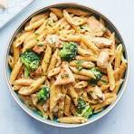

# Pasta

## Culinary Arts Period 6-7 Les Story

### Steps On How To Cook Pasta Properly

1. Make sure when ever you cook pasta you out oil and salt in your water
1. Put it to the boiling point which is 205-210 Degress
1. After it reaches that point put the pasta in and wait 6-8 minutes, depending on the pasta could be longer
1. Once it is done cooking, make sure to keep some pasta water and then strain it
1. Make your sauce or what ever you want and boom

## Cookies

1. When making cookies always make sure to not constantly open then oven
1. Opening the oven and checking on them constantly will ruin the baking process
1. Make sure to set temperature to 375F and make your dough
1. Use Flour, Sugar, Eggs, Vanilla Extract, Salt, Baking Soda, Chocolate Chips
1. If you do to much of a ingredient it could also ruin the cookies
1. Once oven is done put them in for about 8-9 Minutes and should come out really well.

