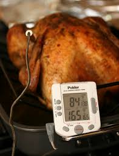
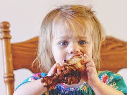
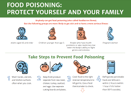

# Chicken

## Culinary Arts Period 6-7 Les Story

### Whats The Proper Way To Cook Chicken?

1. The Proper Temperature That Chicken Should Be Cooked Is At 165 Degrees
1. If You Don't Cook Chicken Properly It Would Cause Very Bad Diseases Such As Food Born Illness, Salmonela And E Coli
1. Always Have A Temperature Reading With You When Cooking Chicken
1. Make Sure The Inside Are Not Pink And Purely White

# What Do If You Do Eat Raw Chicken?

1. If You Do Happen To Eat Raw Chicken.. Stay Hydrated And Get Plenty Of Rest
1. You Will Feel Cramps, Nausea, Fever And Other Symptoms
1. In A Few Days They Should Go Away But See A Doctor If It Continues
1. If You Are A Elderly, Pregnant, Immunocompromised Or A Young Child, It Is Severe That You Drink Water, Broth And Electrolytes Drinks Like Gatorade, Powerade, Etc

