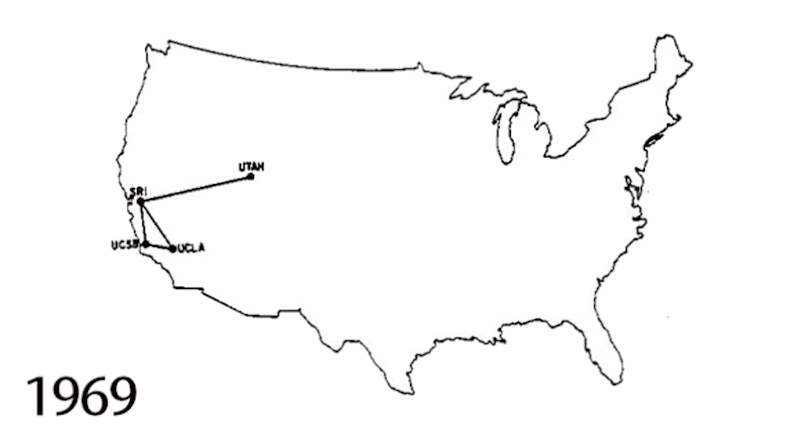

# Key Moments In The History Of The Internet

**From The Cold War To The Web**

##### The internet grew out of Cold War fears and the need to keep communications open during possible nuclear attack. Over time, government research, networking experiments, and new software helped transform ARPANET into the foundation of the modern internet.

| Year | Event | Importance |  
| --------- | ---------- | --------- | 
| 1957    | Sputnik I launched    | The Soviet Union launched Sputnik, increasing U.S, fears during the Space race    | 
| 1958    | ARPA created     | The United States created ARPA to support advanced research and defense projects   | 
| 1969    | ARPANET established        | ARPANET linked four universities and became the foundation for the modern internet    | 
| 1971    | First email sent    | Ray Tomlinson sent the first email and helped popularize the use of the @ Symbol    | 
| 1972    | TCP/IP developed     | Vinton Cerf and Robet Kahn developed the communications protocols that made network connections more reliable   | 
| 1984    | Internet is born        | ARPANET split into MILNET and ARPANET, marking a major step in the birth of the internet     | 
| 1989    | World Wide Web Invented    | Tim Berners-Lee invented the World Wide Web    | 
| 1991    | Web Goes Public     | The World Wide Web became available to the public   |
___

> "The internet has its origin in the fear of nuclear war"

###### ARPANET was important because it showed that distant computer could communicate across a shared network. It was designed to avoid a single point of failure, and many of ideas later became part of the internet people use today